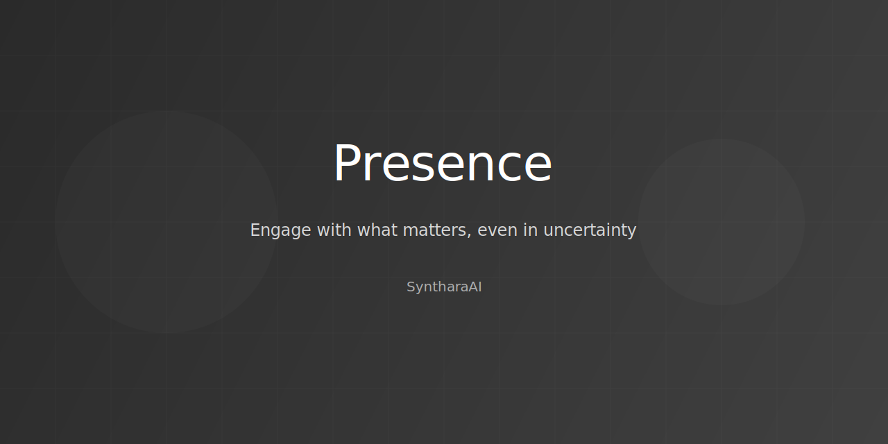

# SyntharaAI Presence



A framework for engaging with what matters, even in uncertainty.

## Core Principles

- **Context**: Honors complexity without oversimplification
- **Presence**: Engages with uncertainty rather than avoiding it
- **Values**: Moves toward what matters, even without perfect clarity
- **Integration**: Meets you where you are, with what you have

## Technical Features

- **Context Engine**: Recognizes complexity without oversimplification
- **Wisdom Core**: Engages with uncertainty rather than avoiding it
- **Values Framework**: Aligns with what matters most to you
- **Presence Layer**: Stays present with complexity rather than eliminating it

## Installation

1. Clone the repository:
   ```
   git clone <repository-url>
   cd rag-gemini-agent
   ```

2. Create a virtual environment:
   ```
   python -m venv venv
   source venv/bin/activate  # On Windows: venv\Scripts\activate
   ```

3. Install dependencies:
   ```
   pip install -r requirements.txt
   ```

4. Set up environment variables:
   ```
   cp .env.example .env
   ```

   Then edit the `.env` file to add your Google API key.

## Usage

### Running the Demo

To run the interactive demo:

```
python demo.py
```

This will start an interactive session where you can ask questions to the RAG Gemini Agent.

### Running the API

To start the API server:

```
python -m uvicorn api:app --reload
```

The API will be available at `http://localhost:8000`. You can access the API documentation at `http://localhost:8000/docs`.

### API Endpoints

- `POST /documents`: Add documents to the vector store
- `POST /query`: Query the agent
- `DELETE /history`: Clear conversation history
- `DELETE /documents`: Clear all documents from the vector store

## Example

```python
from rag_gemini_agent.agent import RAGGeminiAgent

# Begin
agent = RAGGeminiAgent()

# Context
agent.add_documents(
    ["Knowledge", "Wisdom"],
    metadatas=[{"source": "Experience"}, {"source": "Learning"}]
)

# Values
response = agent.query("What matters here?")
print(response)
```

## Configuration

You can configure the agent by modifying the values in `rag_gemini_agent/config.py`.

## Documentation & Website

- **[Documentation](https://your-vercel-deployment-url.vercel.app/documentation.html)**: Complete guide to using SyntharaAI Presence
- **[Main Website](https://your-vercel-deployment-url.vercel.app/premium.html)**: Explore the main interface

## Deployment on Vercel

This project is configured for easy deployment on Vercel.

### Automatic Deployment

1. Push this repository to GitHub
2. Connect the repository to Vercel
3. Vercel will automatically detect the configuration and deploy the site

### Manual Deployment

1. Install Vercel CLI:
   ```bash
   npm install -g vercel
   ```

2. Deploy from the project root:
   ```bash
   vercel
   ```

3. Follow the prompts to complete the deployment

### Running the Website Locally

To run the website locally:

```bash
# Using Python (recommended for development)
cd docs
python server.py
# Site will be available at http://localhost:8082

# Using Node.js
npm start
# Site will be available at http://localhost:3000
```

## License

[MIT License](LICENSE)
